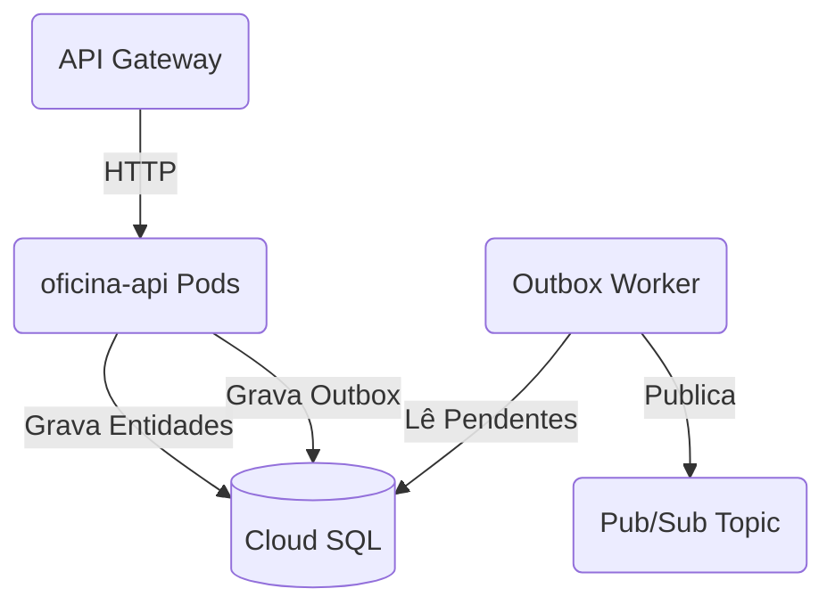

# Oficina Mecânica - API Principal

## Propósito
Este repositório contém o coração do sistema da Oficina Mecânica. Ele é responsável pelo gerenciamento de clientes, veículos, estoque, catálogo de serviços e o motor de estado das Ordens de Serviço (OS), orquestrando transações robustas através do padrão *Unit of Work* e *Outbox*.

## Tecnologias Utilizadas
- **Python 3.12** com **FastAPI**
- **SQLAlchemy 2.0** + Alembic
- **PostgreSQL**
- **Docker** & **Kubernetes**
- **Datadog** (APM via `ddtrace` e Logs JSON)
- **uv** (Gerenciador de pacotes)

## Passos para Execução e Deploy

**Execução Local:**
1. Instale o uv: `curl -LsSf https://astral.sh/uv/install.sh | sh`
2. Instale as dependências: `uv sync`
3. Suba um banco PostgreSQL local no Docker.
4. Rode as migrations: `uv run alembic upgrade head`
5. Inicie a API: `uv run uvicorn src.main:app --reload`

**Deploy:**
O deploy é automatizado via GitHub Actions. Ao realizar o push na branch `main` ou `homolog`, a pipeline realiza o build Docker, envia para o Artifact Registry e aplica os manifestos do `kustomize` (substituindo a imagem via `sed` + `kubectl apply`) direto no GKE.

## Diagrama de Arquitetura

## APIs e Documentação
- **Swagger UI**: Disponível em `/docs` com o servidor rodando.
- **Coleção Postman**: Há um arquivo `collection-postman.json` na pasta `docs/` para testes de integração.
