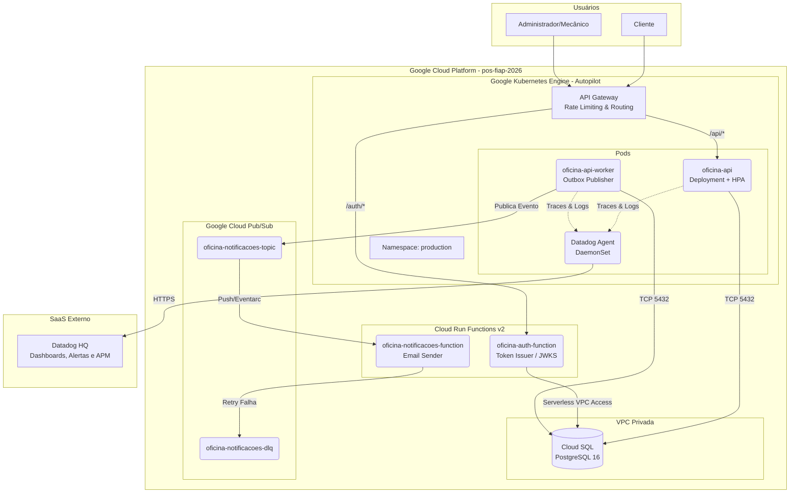

# Diagrama de Componentes e Visão de Nuvem

O diagrama abaixo apresenta o modelo de implantação completo no Google Cloud Platform (GCP).

```mermaid
flowchart TD
    subgraph Users[Usuários]
        Cliente[Cliente]
        Admin[Administrador/Mecânico]
    end

    subgraph GCP[Google Cloud Platform - pos-fiap-2026]
        
        API_GW[API Gateway\nRate Limiting & Routing]
        
        subgraph GKE[Google Kubernetes Engine - Autopilot]
            Namespace_Prod[Namespace: production]
            
            subgraph Pods[Pods]
                API(oficina-api\nDeployment + HPA)
                Worker(oficina-api-worker\nOutbox Publisher)
                DD_Agent(Datadog Agent\nDaemonSet)
            end
            
            API_GW -->|/api/*| API
        end
        
        subgraph Serverless[Cloud Run Functions v2]
            Auth(oficina-auth-function\nToken Issuer / JWKS)
            Notif(oficina-notificacoes-function\nEmail Sender)
        end
        
        API_GW -->|/auth/*| Auth
        
        subgraph VPC_Private[VPC Privada]
            DB[(Cloud SQL\nPostgreSQL 16)]
        end
        
        subgraph PubSub[Google Cloud Pub/Sub]
            Topic(oficina-notificacoes-topic)
            DLQ(oficina-notificacoes-dlq)
        end
        
        API -->|TCP 5432| DB
        Auth -->|Serverless VPC Access| DB
        Worker -->|TCP 5432| DB
        
        Worker -->|Publica Evento| Topic
        Topic -->|Push/Eventarc| Notif
        Notif -->|Retry Falha| DLQ
        
        API -.->|Traces & Logs| DD_Agent
        Worker -.->|Traces & Logs| DD_Agent
    end

    subgraph SaaS[SaaS Externo]
        DD_Cloud[Datadog HQ\nDashboards, Alertas e APM]
    end
    
    DD_Agent -->|HTTPS| DD_Cloud
    
    Cliente --> API_GW
    Admin --> API_GW
```
