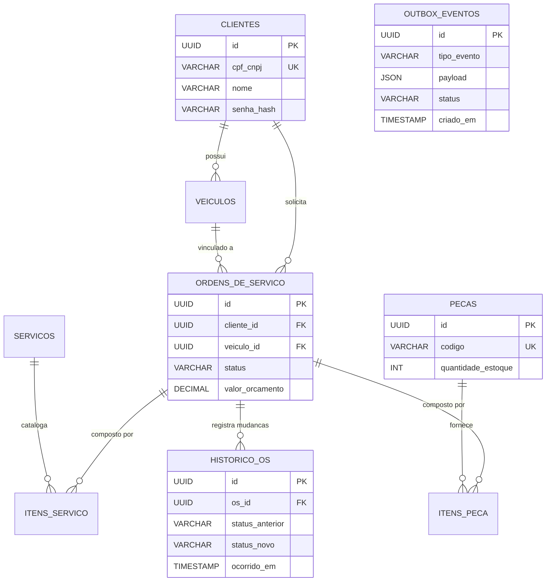

# Modelo Entidade-Relacionamento e Justificativa

## 1. Escolha do Banco de Dados
A escolha recaiu sobre o **PostgreSQL Gerenciado (Cloud SQL)**.
* **Justificativa Técnica**: O PostgreSQL possui suporte avançado a consistência ACID, bloqueios de linha (`SELECT FOR UPDATE`), além de tipos complexos como `JSONB` e `UUID` nativos. Para o módulo de controle de **Estoque** e **Outbox Pattern**, a concorrência exige suporte robusto a transações e isolamento, minimizando deadlocks que ocorrem com frequência em bancos não relacionais ou ISAMs antigos. Além disso, o suporte ao uso de chaves assimétricas em queries futuras suportou essa escolha.
* **Por que Gerenciado?**: Num ambiente cloud (Tech Challenge), gerenciar replicação física de logs (WAL), Point-in-Time-Recovery (PITR) e snapshots via StatefulSets no Kubernetes exige muita carga operacional. O Cloud SQL abstrai tudo isso.

## 2. Diagrama ER (Entidade-Relacionamento)

## 3. Explicação dos Relacionamentos

- **CLIENTES e VEICULOS**: Um cliente possui um ou mais veículos (1:N). No cadastro do veículo a API exige a vinculação.
- **ORDENS_DE_SERVICO**: É a entidade raiz de agregação no sistema. Agrupa o cliente solicitante, o veículo alvo, as **Peças** (`ITENS_PECA`) consumidas e os **Serviços** (`ITENS_SERVICO`) realizados.
- **HISTORICO_OS**: Uma OS possui 1 ou mais históricos (1:N). Foi modelada como uma tabela *Append-only*. Isso garante integridade de trilha de auditoria: nunca damos *UPDATE* num histórico, apenas *INSERT* com o delta de estado (`status_anterior` e `status_novo`).
- **PECAS e ESTOQUE**: A tabela de peças abstrai também o estoque atual. Ao utilizar uma peça numa OS (após aprovação do cliente), o estoque é diminuído atomicamente via *Row Lock*.
- **OUTBOX_EVENTOS**: Totalmente desacoplada do negócio primário, sendo apenas persistida na mesma transação para ser drenada posteriormente por um *Worker*.
