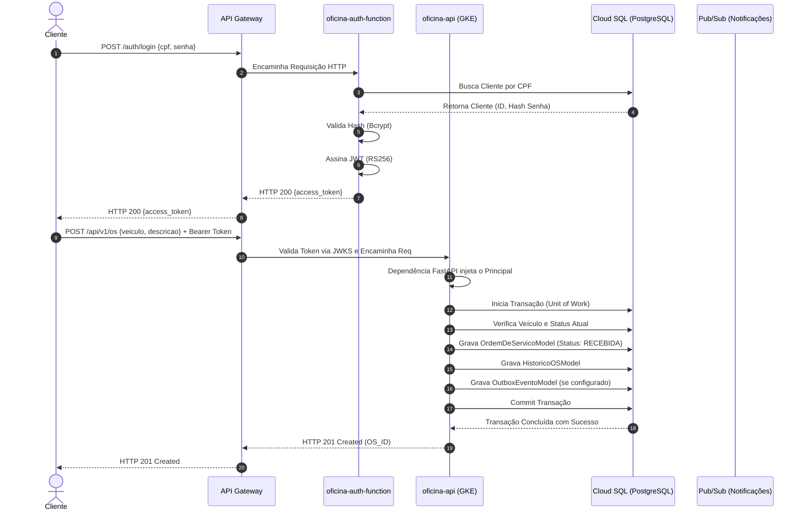

# Diagrama de Sequência

Abaixo detalhamos o fluxo arquitetônico e de negócio para **Autenticação de Cliente** seguido da **Abertura de uma Ordem de Serviço**.

```mermaid
sequenceDiagram
    autonumber
    actor Cliente
    participant GW as API Gateway
    participant Auth as oficina-auth-function
    participant API as oficina-api (GKE)
    participant DB as Cloud SQL (PostgreSQL)
    participant Topic as Pub/Sub (Notificações)
    
    %% Fluxo de Autenticação
    Cliente->>GW: POST /auth/login {cpf, senha}
    GW->>Auth: Encaminha Requisição HTTP
    Auth->>DB: Busca Cliente por CPF
    DB-->>Auth: Retorna Cliente (ID, Hash Senha)
    Auth->>Auth: Valida Hash (Bcrypt)
    Auth->>Auth: Assina JWT (RS256)
    Auth-->>GW: HTTP 200 {access_token}
    GW-->>Cliente: HTTP 200 {access_token}
    
    %% Fluxo de Abertura de OS
    Cliente->>GW: POST /api/v1/os {veiculo, descricao} + Bearer Token
    GW->>API: Valida Token via JWKS e Encaminha Req
    API->>API: Dependência FastAPI injeta o Principal
    API->>DB: Inicia Transação (Unit of Work)
    API->>DB: Verifica Veículo e Status Atual
    API->>DB: Grava OrdemDeServicoModel (Status: RECEBIDA)
    API->>DB: Grava HistoricoOSModel
    API->>DB: Grava OutboxEventoModel (se configurado)
    API->>DB: Commit Transação
    DB-->>API: Transação Concluída com Sucesso
    API-->>GW: HTTP 201 Created (OS_ID)
    GW-->>Cliente: HTTP 201 Created
```
